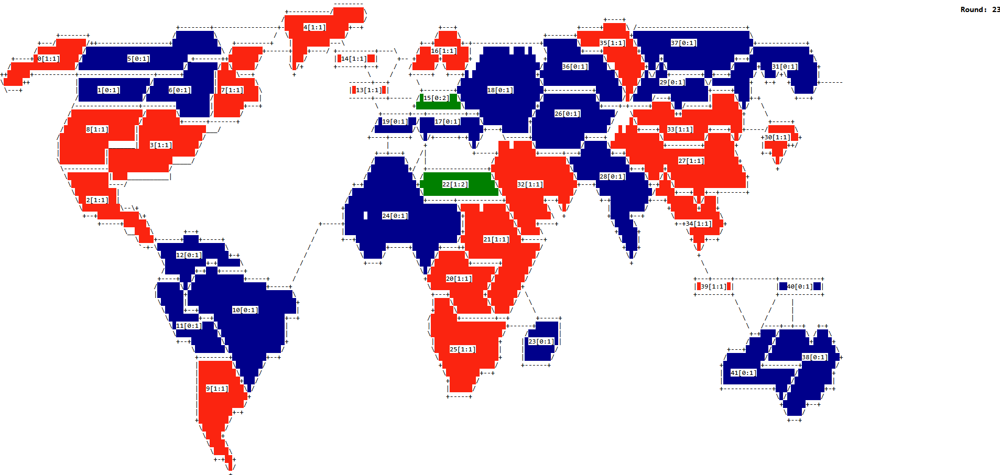
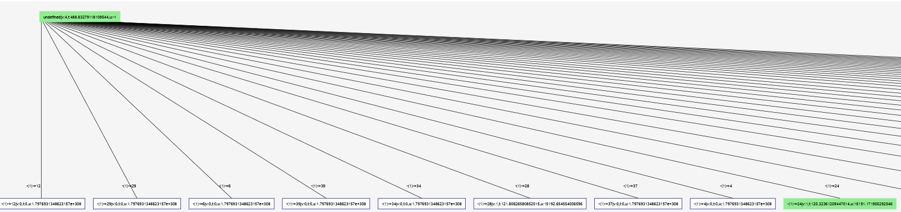

# Node.js Game State Viewer

!!! Because of elk.js tree event debugging is only supported in Firefox !!!

Because it was very hard to debug the game in the console
and the tree, we developed an own debugging tool.

This debugging tool takes two types of event logs (BOARD, TREE) from the EventLogService (logging needs to be enabled)
and represents them in a visually more appealing way.

You can use F10 and F11 to iterate over the log entries.
+ F10: Step to the end of an event type (TREE) or to next event if already finished with type
+ F11: Step to next event

## Debugging Of The Board Event
Because the map and the changes of the map are very
hard to see in the default command line interface,
the programm renders the board and its event
logs in a browser with different colors for the players and changes.

## Debugging Of The Tree Event
Because it was sometimes very hard to follow decisions in the 
tree we decided to print the tree using custom events and
debug the MCTS steps one by one.

